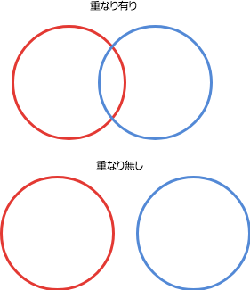

II. SQL言語 第5章 データ定義
==================

データを格納・保持するための方法について学ぶ。

- データを入れるためのテーブル
- 整合性のあるデータとするため制約
- データにアクセスするための権限・スキーマ
- データ格納方式としてのパーティショニング
- 外部データ

以上について実際に操作して学ぶ。

### 5.1 テーブルの基本

#### 概要

- リレーショナルデータベースのテーブルは表と似ている
- 行と列からできている
- 列の数と順序は固定
- 行は可変
- 行の順序は保証されない
- 列にはデータ型がある
- PostgreSQLは多数のデータ型が組み込まれている

#### SQL 

- CREATE TABLE
- DROP TABLE

### 5.2 デフォルト値

#### 概要

- 列にはデフォルトの値を割当てることができる
- 新しく行が生成される際に列に値が指定されていない場合、デフォルト値が設定される。
- 明示的にデフォルト値を指定することもできる

- 例
    - デフォルト値として通常の定数
    - デフォルト値として式
        - 連番をふる場合、シーケンスオブジェクトから連番を取得
    - SERIAL型の列として使える短縮記法
    - timestamp列が挿入時刻になるように

### 5.3 制約

#### 概要

- 型によって格納するデータの種類が限定されるが、それだけでは精密さに欠ける
    - 例: 価格は数値だが、正の数のみ受け入れられる
- 他の列や行に関連して制約したい
    - 例: 製品情報の製品番号は一意であるべき
- 列およびテーブルに対するデータを制御し、整合性の取れるデータを目指す

#### 5.3.1 検査制約

- CHECK
- 到底の列の値が論理式を満たすようにする
- CONSTRAINT で制約名
- 列制約とテーブル制約

#### 5.3.2 非NULL制約
- NOT NULL
- NULLの挿入を禁止

#### 5.3.3 一意性制約
- UNIQUE
- 列、あるいは列のグループに含まれるデータがすべての行で一意
- 列制約とテーブル制約
- 一意性制約があってもNULLを持つ行を複数格納できる(標準SQL準拠だがRDBMSによっては違うから注意)

#### 5.3.4 主キー
- PRIMARY KEY
- 行を一意に識別するためのNOT NULLで一意な列、または列のグループ
- テーブルに1つ
- 列制約とテーブル制約

#### 練習 5-1

次のテーブルを作成し、制約が機能することを確認

- テーブル: ユーザー(users)
    - ユーザーID(user_id) integer 主キー
    - スクリーン名(screen_name) text 一意
    - 所持金 (gold) integer 

- すべての列はnot null
- ユーザーIDを主キーとする
- スクリーン名で一意であること
- 所持金は0以上であること

確認内容

CREATE TABLE文を解答とする。

- null値で挿入できないこと
- ユーザーIDの重複が許されないこと
- スクリーン名の重複が許されないこと
- 所持金が0未満で挿入できないこと

#### 5.3.5 外部キー

- REFERENCES
- 列の値が、他のテーブルの行の値と一致しなければならない。存在しなければならない。
- 列制約とテーブル制約
- 削除の制限
    - ON DELETE RESTRICT
    - ON DELETE CASCADE
    - ON DELETE SET NULL
    - ON DELETE SET DEFAULT
- 更新の制限
    - ON UPDATE ...

#### 5.3.6 排他制約

- EXCLUDE USING  ... WITH ...
- インデックスを作成して演算子を使って比較した結果FALSEであること
    - UNIQUEインデックスを使って=演算子の結果がFALSEであること→一意性制約と同義（パフォーマンスは違う）
- gistインデックスを使って円が重ならないことを制約として設ける

#### 練習 5-2

排他制約で例にあがったcirclesテーブルを作成し、制約が機能することを確認。

- テーブル: 円テーブル(circles)
    - 円(c) circle 
- circle型が重ならないことを排他制約で定義
    - 重なりを&&でチェックできる
    - gistインデックスを使うことで範囲の含有などの演算子を高速に検索できる

確認内容

エラーとなるINSERT文2つを解答とする。

- 範囲が重なる円のデータが挿入できないことを確認
- 円データ型については[8.8.7 円](https://www.postgresql.jp/document/9.6/html/datatype-geometric.html#datatype-circle)を確認。
- 文字列で指定circle構文を指定して、circle型にキャストする。(INSERT時は型が明確なので暗黙のキャストができる)

