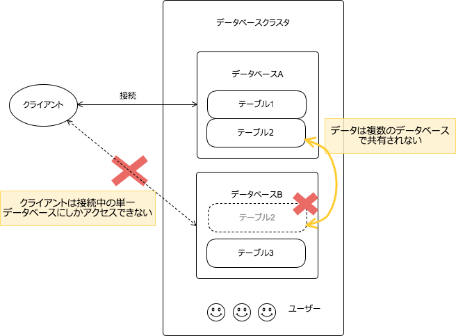
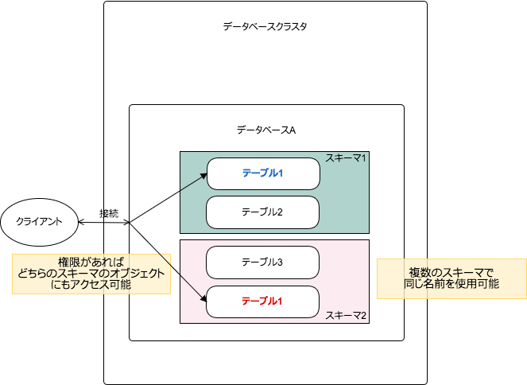

II. SQL言語 第5章 データ定義
==================

### 5.4 システム列

すべてのテーブルにはシステムによって暗黙的に定義されたシステム列がある。

- oidは32ビット数でクラスタ全体で1つのカウンタ

### 5.5 テーブルの変更

#### 概要

- テーブルの変更後にテーブルの定義を変更する。削除して再作成ではなくデータを残したまま変更を行う。
    - 列の追加、削除
    - 制約の追加、削除
    - デフォルト値の変更
    - データ型の変更
    - 列名、テーブル名の変更
- ALTER TABLEコマンドで行う。
    - 列追加, ALTER TABLE ... ADD COLUMN ...
    - 列削除, ALTER TABLE ... DROP COLUMN ...
    - 制約追加, ALTER TABLE ... ADD CHECK ...
    - 制約追加, LTER TABLE ... ADD CONSTRAINT ...
    - 制約追加, LTER TABLE ... ADD FOREIGN KEY ...
    - 制約削除, ALTER TABLE ... DROP CONSTRAINT ...
    - 列変更, ALTER TABLE ... ALTER COLUMN ...
    - 列名変更, ALTER TABLE ... RENAME COLUMN ...
    - テーブル名変更, ALTER TABLE ... RENAME TO ...

#### 練習 5-3

emp-dept.sqlで、emp, dept表を作成後、以下のテーブルの変更を行うこと。

- emp表に列追加 post_no varchar(7)
- emp表のcomm列にデフォルト0制約追加
- emp表のcomm列にNOT NULL制約追加（現在nullの行には0を設定)
- dept表のdeptno列名をdnoに変更

確認内容

上記を満たすSQL文

### 5.6 権限(サラッと)

#### 概要
- オブジェクトが作成されると所有者が割り当てられる
    - 通常は作成したロール
- 他のユーザがオブジェクトを使用する際には権限が必要
    - SELECT
    - INSERT 
    - UPDATE 
    - DELETE
    - TRUNCATE
    - TRIGGER
    - CREATE
    - CONNECT
    - TEMPORARY
    - USAGE
- 権限の割り当てには`GRANT`
    - `GRANT UPDATE ON accounts TO joe`
- PUBLICロール
    - すべてのロールを表すロール
- 権限を取り消すには`REVOKE'
    - `REVOKE ALL ON accounts FROM PUBLIC;

### 5.7 行セキュリティポリシー(サラッと)

- テーブルに対して行レベルセキュリティポリシーを使用する設定をする
    - `ALTER TABLE accounts ENABLE ROW LEVEL SECURITY`
- 行単位での可視設定、データ変更の可能性ポリシー 
    - CHECK制約風
    - `CREATE POLICY account_managers ON accounts TO managers USING (manager=current_user)`

#### 練習 5-4

emp-dept.sqlで、emp, dept表を作成、所有者と別のユーザーfoobarを作成し
foobarに読み取り権限を与える。

- `\i /vagrant/sql/emp-dept.sql`

さらに、foobarがアクセスできるのは job='MANAGER' となる行だけとする。

### 5.8 スキーマ

#### 概要

- データベース内のオブジェクトを論理グループにまとめる。
- 接続できるデータベースは1つだけ
- データは複数のデータベース間で共有されない
- 同じオブジェクト名を複数のスキーマで使用することができる
- publicスキーマ





#### 5.8.1 スキーマの作成

- CREATE SCHEMA myschema
- DROP SCHEMA myschema
- DROP SCHEMA mmyschema CASCADE

#### 5.8.2 publicスキーマ

- デフォルトではpublicスキーマに入れられる

#### 5.8.3 スキーマ検索のパス

- SHOW search_path
- SET search_path TO hoge,public

#### 5.8.4 スキーマおよび権限

- スキーマにアクセスする権限 USAGE
    - GRANT USAGE ON hogeschema TO foobar;

#### 5.8.5 システムカタログスキーマ

- pg_catalogスキーマ
    - システムテーブル
    - 組み込みデータ型、関数


### 5.9 継承(サラッと)

- 属性の継承
- 制約は継承されるものとされないものがあるので注意

次のパーティショニングで継承をつかうのでそこで確認

### 5.10 パーティショニング

論理的に1つの大きなテーブルを物理的に分割する手法。

- 範囲分割
- リスト分割

#### 5.10.2 パーティショニングの実装

- マスタとなるテーブルを作成
    - データは格納しない
- マスタから継承された子テーブルを作成(パーティション)
    - 列を追加しない
- それぞれのパーティションでチェック制約を追加
    - あいまいさがないように

#### 練習 5-5

empテーブルでパーティショニングをする。

- empテーブルをマスタとした、jobがSALESMANのパーティションとそれ以外のパーティションを作る。
    - emp
    - emp_sales
    - emp_other

- emp-dept.sqlをコピーして作成
- empを継承したemp_sales
    - チェック制約 job = 'SALESMAN'
```
    CREATE TABLE emp_sales (
        CHECK (/* ===== */)
    ) INHERITS (/* ===== */);
```
- empを継承したemp_other
    - チェック制約 job != 'SALESMAN'
```
    CREATE TABLE emp_other (
        CHECK (/* ===== */)
    ) INHERITS (/* ===== */);
```
- 各パーティションのJobにインデックス作成

```
CREATE INDEX idx_emp_sales_job ON /* ===== */ ;
CREATE INDEX idx_emp_other_job ON /* ===== */;
```
- trigger関数の作成と登録
    - ドキュメント参考に
```
-- triger関数の作成
CREATE OR REPLACE FUNCTION emp_insert_trigger()
RETURNS TRIGGER AS $$
BEGIN
    IF ( NEW.job = /* ===== */ ) THEN
        INSERT INTO /* ===== */ VALUES (NEW.*);
    ELSE
        INSERT INTO /* ===== */ VALUES (NEW.*);
    END IF;

    RETURN NULL;
END;
$$
LANGUAGE plpgsql;

-- trigerの登録
CREATE TRIGGER insert_emp_trigger
    BEFORE INSERT ON emp
    FOR EACH ROW EXECUTE PROCEDURE emp_insert_trigger();
```
- データ投入
    - emp-dept.sqlからコピー

確認
- empを検索して全件取得できるか
- 行がどのテーブル由来のデータか確認
    - `SELECT emp.tableoid, * FROM EMP`
- jobを条件にした検索での実行計画を確認
    - `ANALYZE`
    - `EXPLAIN SELECT COUNT(*) FROM emp WHERE job = 'SALESMAN'

### 5.11 外部データ

CSVファイルなどの外部データを表と同じように扱う。

表のようにSELECT文を実行するが、外部データラッパ(FDW)に処理を委譲する。

- mysql_fdw
- redis_fdw
- file_fdw

### 5.12 その他のデータベースオブジェクト

- ビュー
- 関数、演算子
- データ型、ドメイン
- トリガ、書き換えルール

### 5.13 依存関係の追跡

- 外部キーで参照されているテーブルを削除しようとしてもできない。→依存関係がある。
    - CASCADEでできる
- 関数の実態の依存性は追跡されない（実行時にきまる）

