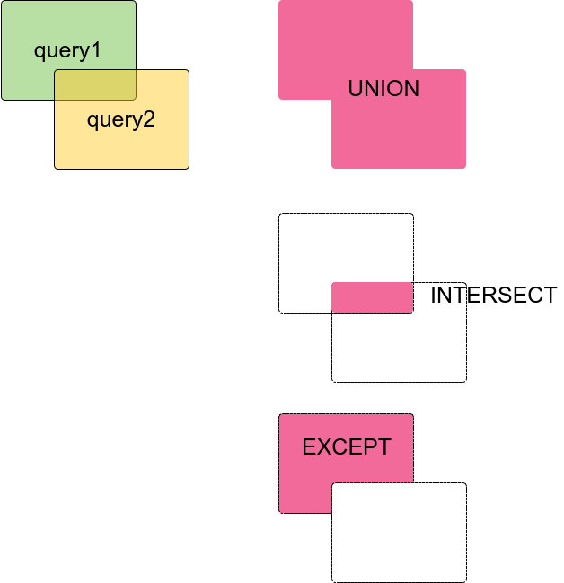

II. SQL言語 第7章 問い合わせ
==================

### 7.3 選択リスト

前節までで、SELECTコマンド中のテーブル式でデータを取得するための仮想テーブルを作った。
このテーブルに対して、最終的に選択リストからどの列を実際に出力するかを決める。

- 最も単純な選択リスト `*`
- カンマで区切られた評価式のリスト
- テーブルの列名、列名に対する別名
- ２つ以上のテーブルで同じ名前の列がある場合は、テーブル名を指定しなければならない
    - `SELECT tbl1.a, tbl2.a, tbl1.b, FROM...`
- 選択リストの評価式はテーブル式内の列を参照する必要はない
    - `SELECT sal * 1.08 FROM emp`  //テーブル式内の列参照
    - `SELECT 1+2 FROM emp`  //参照していない定数式

#### 7.3.2 列ラベル

- 選択リストの中の項目は、名前を割り当てることができる
- ASは省略可能
- PostgreSQLキーワードと一致するラベルは、二重引用符で囲むことで使用可能
    - SELECT deptno "WHERE" FROM emp

#### 7.3.3 DISTINCT

- 重複行をのぞいた出力を取得
- DISTINCT ON で一致するための評価を行うことができる
    - どんな値を使って一致チェックするかの式を書ける

### 練習 7-5

emp表から列ラベルを使ってjobの重複のない一覧を「役職」という列タイトルで取得する。

- `\i /vagrant/sql/emp-dept.sql`を使ってemp表を作成しておく
```
   役職
-----------
 CLERK
 SALESMAN
 MANAGER
 PRESIDENT
 ANALYST
```

### 練習 7-6

emp表から各job別の代表社員を1名選んでjob別代表社員一覧を出力せよ。
job内の代表社員は **job内の任意の1社員とし任意の1社員の選択はどれでもよい** ものとする。

- `\i /vagrant/sql/emp-dept.sql`を使ってemp表を作成しておく
- DISTINCT ONを使用して、jobの一致を重複とみなす
- 応用:同じ結果をDISTINC ONを使わずに書いてみる
    - DISTINCT ONは使わないがDISTINCTは可のパターン
        - ヒント WINDOW関数でFIRST_VALUEを使う（jobで分けたグループの最初の社員）
    - DISTINCTもWINDOW関数も使わないパターン
        - ヒント GROUP BYでjobのグループを出力し、jobごとに社員1件取得

```
   役職    | 代表社員
-----------+----------
 ANALYST   | SCOTT
 CLERK     | JAMES
 MANAGER   | JONES
 PRESIDENT | KING
 SALESMAN  | TURNER
```

### 7.4 問い合わせの結合

- UNION
    - 和集合
- INTERSECT
    - 積集合
- EXCEPT
    - 差集合
- UNION互換であること
    - 同じ数の列
    - 対応する列はご感染のあるデータ型
    - 列名が一致しなくてよい




### 7.5 行の並べ替え

- 問い合わせが生成した出力テーブルを並び替える
- 指定しない場合は無規則
    - スキャンの実装やディスク上の順序に依存するがそれを当てにしない
    - 保証するには必ずORDER BY
- ASC, DESC
- NULLS FIRST, NULLS LAST

### 7.6 LIMITとOFFSET

- LIMIT
    - 得られる行数の制限
- OFFSET
    - 読み飛ばす行数
- ORDER BYを使わないとLIMITの結果が変わる


### 練習 7-7

- emp表の検索結果を10件でページングするように検索する
    - empnoでソートした1ページ目(先頭10件)
    - 2ページ目(11〜20件) ただし20件に満たない場合はそこで終了

### 7.7 VALUESリスト

- 定数テーブルを作成
- ディスク上に保存することなく問い合わせで使用できるテーブル


### 7.8 WITH 問い合わせ（共通テーブル式）

- 複雑な副問合せを単純な部品に分解

社員一覧にjob別のMAX(sal)を結合したもの (window関数でもできる)
```
SELECT empno, ename, js.job, js.max_sal
FROM EMP
JOIN (
    SELECT job, MAX(sal) max_sal FROM emp 
    GROUP BY job
) js USING(job)

```
WITH問い合わせで、副問合せ分を先に分割する
```
WITH js AS(
    SELECT job, MAX(sal) max_sal FROM emp
    GROUP BY job
)
SELECT empno, ename, js.job, js.max_sal
FROM EMP JOIN js USING(job)
;
```

- WITH RECURSIVEを使えば、通常のSQLでは不可能な機能を実現できる
- 例：emp表の上司から部下のツリーを出力

```
WITH RECURSIVE emp_tree(empno, ename, mgr, path) AS (
    SELECT empno, ename, mgr, '/' || ename FROM emp WHERE empno = 7839
    UNION ALL
    SELECT e.empno, e.ename, e.mgr, t.path || '/' || e.ename  FROM emp_tree  t, emp e
    WHERE e.mgr = t.empno
)
SELECT * FROM emp_tree ORDER BY path;
```

```
 empno | ename  | mgr  |          path
-------+--------+------+-------------------------
  7839 | KING   |      | /KING
  7698 | BLAKE  | 7839 | /KING/BLAKE
  7499 | ALLEN  | 7698 | /KING/BLAKE/ALLEN
  7900 | JAMES  | 7698 | /KING/BLAKE/JAMES
  7654 | MARTIN | 7698 | /KING/BLAKE/MARTIN
  7844 | TURNER | 7698 | /KING/BLAKE/TURNER
  7521 | WARD   | 7698 | /KING/BLAKE/WARD
  7782 | CLARK  | 7839 | /KING/CLARK
  7934 | MILLER | 7782 | /KING/CLARK/MILLER
  7566 | JONES  | 7839 | /KING/JONES
  7902 | FORD   | 7566 | /KING/JONES/FORD
  7369 | SMITH  | 7902 | /KING/JONES/FORD/SMITH
  7788 | SCOTT  | 7566 | /KING/JONES/SCOTT
  7876 | ADAMS  | 7788 | /KING/JONES/SCOTT/ADAMS
(14 rows)

```

